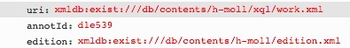

# getAnnotationOpenAllUris.xql
## Input parameters:
```
$uri := request:get-parameter('uri', '')

$annotId := request:get-parameter('annotId', '')
```
## Import:
```
../xqm/source.xqm

../xqm/teitext.xqm
```
## Following data are returned
Get source participants and start id's of range.

## Example
### Parameter


### XML
```
<annot type="editorialComment" xml:id="d1e539" plist="xmldb:exist:///db/contents/h-moll/neusatz.xml#measure-2-d4e27 xmldb:exist:///db/contents/h-moll/source_D-21.xml#edirom_measure_8e34a4bf-68d4-47b8-915a-b806b28f2999">
 	<title>1. Kyrie I, m. 19, Obda I</title>
 	<p>
 		<rend rend="bold">B 13</rend>
 		: with slur on 19/8–20/1
 	</p>
 	<ptr type="priority" target="#ediromAnnotPrio1"/>
 	<ptr type="categories" target="#SLB"/>
</annot>
```
                        
### Result JSON
```
xmldb:exist:///db/contents/h-moll/neusatz.xml#measure-2-d4e27
xmldb:exist:///db/contents/h-moll/source_D-21.xml#edirom_measure_8e34a4bf-68d4-47b8-915a-b806b28f2999
```


