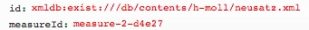

# getMeasure.xql
## Input parameters:
```
$id := request:get-parameter('id', '')

$measureId := request:get-parameter('measureId', '')
```
## Show following data informations
for measure with $measureIdName

1. measureId:

2. movementId:
```
$mei/id($measureId)/ancestor::mei:mdiv[1]/@xml:id
```

3. measureCount:
```
if(contains($measureId, 'tstamp2='))
then(number(substring-before(substring-after($measureId, 'tstamp2='), 'm')) + 1)
else(1)
```

## Example
### Parameter

### XML
```
...
<mdiv xml:id="mdiv-2-d3" label="1. Kyrie I">
...
<measure xml:id="measure-2-d4e27" n="19" facs="#zone-2-d4e27"/>
```

### Result
```
{measureId:"measure-2-d4e27",movementId:"mdiv-2-d3",measureCount:"1"}
```


