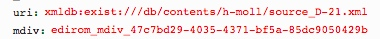

# getMeasures.xql
## Input parameters:
```
$uri := request:get-parameter('uri', '')

$mdivID := request:get-parameter('mdiv', '')
```
## Show following data informations
### If mei:parts exists:
```
$mdiv := $mei/id($mdivID)
```
for each 
```
$measureN in distinct-values($mdiv//mei:measure/@n):
```

1. name:
```
$measureN
```

2. mdivs:
```
$mdiv/@xml:id
```

3. ID:
```
"measure_', $mdiv/@xml:id, '_', $measureN, '"
```

4. measures:
```
let $measureNNumber := number($measureN)

let $measures := $mdiv//mei:measure[.//mei:multiRest][number(@n) lt $measureNNumber][.//mei:multiRest/number(@num) gt ($measureNNumber - number(@n))]
            
let $measures := for $measure in $mdiv//mei:measure[@n = $measureN] | $measures
		return
			concat('{id:"', $measure/@xml:id, '", voice: "', $measure/ancestor::mei:part//mei:staffDef/@decls, '"}')
```

### Else:
```
for $measure in $mei/id($mdivID)//mei:measure
```

1. name:
```
$measure/@n
```

2. mdivs:
```
$measure/ancestor::mei:mdiv[1]/@xml:id
```

3. ID:
```
$measure/@xml:id
```

4. measures:
```
[{id:"', $measure/@xml:id, '", voice: "score"}]
```
## Example
### Parameter

### XML
```
...
 <mdiv xml:id="edirom_mdiv_47c7bd29-4035-4371-bf5a-85dc9050429b" label="1. Kyrie I">
 	<parts>
 		<part xml:id="d1e30318" label="B1 Soprano I">
 			<staffDef decls="#instr_sop1"/>
 			<section>
 				<measure n="1" xml:id="edirom_measure_656c3096-f3d1-403f-bc97-4a27f7b0c9b3" facs="#edirom_zone_0d34644b-fe61-4f2c-85d3-886cd9222632"/>
 ...
 ```  
                          
### Result Fragment
```
[{id: "measure_edirom_mdiv_47c7bd29-4035-4371-bf5a-85dc9050429b_1", 
measures: [{id:"edirom_measure_656c3096-f3d1-403f-bc97-4a27f7b0c9b3", voice: "#instr_sop1"},...
```


