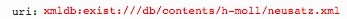

# getMovements.xql
## Input parameters:
```
$uri := request:get-parameter('uri', '')
```
## Show following data informations
### For each movement in mei:mdiv:
1. ID:
```
$movement/string(@xml:id)
```

2. Name:
```
$movement/string(@label)
```

## Example
### Parameter

### XML
```
...
<mdiv xml:id="mdiv-2-d3" label="1. Kyrie I">
...
<mdiv xml:id="mdiv-28-d3" label="2. Christe eleison">
...
```

### Result Fragment JSON
```
{id: "mdiv-2-d3", name: "1. Kyrie I"},{id: "mdiv-28-d3", name: "2. Christe eleison"}
```

