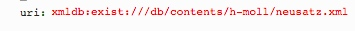

# getPages.xql
## Input parameters:
```
$uri := request:get-parameter('uri', '')
```
## Show following data informations
### For MEI-Forma
For each mei:surface:

1. Facsimile:
```
let $graphic := $surface/mei:graphic[@type='facsimile']
```

2. ID:
```
$surface/string(@xml:id)
```

3. Path:
```
$graphic/string(@target)
```

4. Name:
```
$surface/string(@n)
```

5. Width:
```
$graphic/string(@width)
```

6. Height:
```
$graphic/string(@height)
```
                
### For TEI-Format
For each tei:surface:

1. Facsimile:
```
let $graphic := $surface/tei:graphic[1]
```

2. ID:
```
$surface/string(@xml:id)
```

3. Path:
```
$graphic/string(@url)
```

4. Name:
```
$surface/string(@n)
```

5. Width:
```
replace($graphic/string(@width), 'px', '')
```

6. Height:
```
replace($graphic/string(@height), 'px', '')
```

### Example
#### Parameter

#### XML
```
...
<surface n="2" xml:id="surface-2-d4e2">
	<graphic target="h-moll/edition/Neusatz_s002.jpg" xml:id="graphic-2-d4e2" type="facsimile" width="2976" height="3838" label="2"/>
...
                
```

#### Result Fragment JSON

```
{id: "surface-2-d4e2", path: "h-moll/edition/Neusatz_s002.jpg", name: "2", width: "2976", height: "3838"}
```


