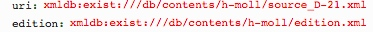

# getParts.xql
## Input parameters:
```
$uri := request:get-parameter('uri', '')
```
## Show following data informations
For each part in mei:instrumentation/mei:instrVoice

1. Label:
```
$part/@label
```

2. ID:
```
$part/@xml:id
```

3. selectedByDefault: true

4. selected: true

## Example
### Parameter

### XML
```
...
<perfMedium>
	<instrumentation>
		<instrVoice label="B1 Soprano I" xml:id="instr_sop1"/>
...
```
                        
### Result Fragment
```
{label: "B1 Soprano I", id:"instr_sop1", selectedByDefault:true, selected:true}
```


