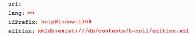
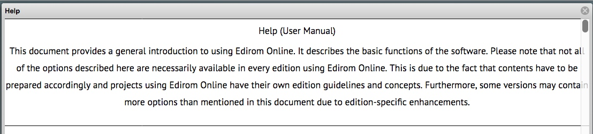
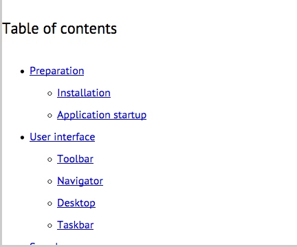

# getHelp.xql
## Input parameters:
```
$lang := request:get-parameter('lang', 'en')

$idPrefix := request:get-parameter('idPrefix', '')
```
## Imports
```
../xslt/edirom_langReplacement.xsl

../xslt/teiBody2HTML.xsl

../xslt/edirom_idPrefix.xsl
```

## Show following data informations as HTML
Transform Help-file

1. [edirom_langReplacement](edirom_langReplacement.md)

2. [teiBody2HTML](../transformations/getText/text/teiBody2HTML.md)

3.  [edirom_idPrefix](edirom_idPrefix.md)

## Example
### Parameter


### Result
HTML page

### Screenshot


...


