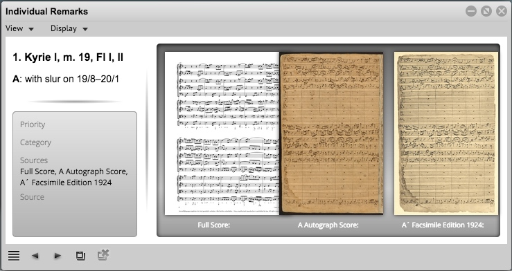

Following services are called:
[getAnnotationText.md](../../../workobject/annotationView/doubleclickAnnot/getAnnotationText.md)

[getAnnotationMeta.md](../../../workobject/annotationView/doubleclickAnnot/getAnnotationmeta.md)

[getAnnotationPreviews.md](../../../workobject/annotationView/doubleclickAnnot/getAnnotationPreviews.md)

#### Result

