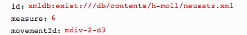

# getMeasurePage.xql
## Input parameters:
```
$id := request:get-parameter('id', '')

$measureIdName := request:get-parameter('measure', '')

$movementId := request:get-parameter('movementId', '')

$measureCount := request:get-parameter('measureCount', '1')
```
## Show following data informations
for measure with $measureIdName

1. measureId:
```
$measure/string(@xml:id)
```

2. zoneId:
```
substring-after($measure/string(@facs), '#')
```

3. pageId:
```
let $zoneId := substring-after($measure/string(@facs), '#')
let $zone := $mei/id($zoneId)
let $surface := $zone/parent::mei:surface
```
```
$surface/string(@xml:id)
```

4. path:
```
$surface/mei:graphic[@type='facsimile']/string(@target)
```

5. width:
```
$surface/mei:graphic[@type='facsimile']/string(@width)
```

6. height:
```
$surface/mei:graphic[@type='facsimile']/string(@height)
```

7. ulx:
```
$mei/id($zoneId)/string(@ulx)
```

8. uly:
```
$mei/id($zoneId)/string(@uly)
```

9. lrx:
```
$mei/id($zoneId)/string(@lrx)
```

10. lry:
```
$mei/id($zoneId)/string(@lry)
``` 
## Example
### Parameter


### XML
```
...
<surface n="3" xml:id="surface-2-d4e8">
                <graphic target="h-moll/edition/Neusatz_s003.jpg" xml:id="graphic-2-d4e8" type="facsimile" width="2976" height="3838" label="3"/>
...
<zone xml:id="zone-2-d4e11" type="measure" ulx="718" uly="192" lrx="1266" lry="1954"/>
...
<measure xml:id="measure-2-d4e11" n="6" facs="#zone-2-d4e11"/>
...
```

### Result
```
{measureId:"measure-2-d4e11",zoneId:"zone-2-d4e11",pageId:"surface-2-d4e8", movementId:"mdiv-2-d3",path: "h-moll/edition/Neusatz_s003.jpg", width: "2976", height: "3838", ulx: "718", uly: "192", lrx: "1266", lry: "1954"}]
```


