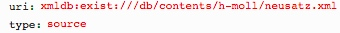

# getHeader.xql
## Input parameters:
```
$uri := request:get-parameter('uri', '')

$type := request:get-parameter('type', '')

$lang := request:get-parameter('lang', 'de')
```
## HTML Text
Tranform with [meiHead2HTML](../../../transformations/getHeader/note/meiHead2HTML.md):
```
transform:transform($doc, concat($base, 'meiHead2HTML.xsl'), 
<parameters><param name="base" value="{$base}"/>
<param name="lang" value="{$lang}"/></parameters>)
```
## Example
### Parameter


### Result
```
<div xmlns="http://www.w3.org/1999/xhtml" class="meiHead">
    <div>
        <div class="section">
            <h1>Dateinformationen</h1>
            <div class="propertyList">
                <div class="property">
                    <div class="key">Titel</div>
                    <div class="value">Neusatz</div>
                </div>
                <div class="property">
                    <div class="key">Publikation</div>
                    <div class="value"></div>
                </div>
                <div class="section">
                    <h1 class="key">Quellenbeschreibung</h1>
                    <div class="propertyList">
                        <div class="property">
                            <div class="key">Titel</div>
                            <div class="value">Full Score</div>
                        </div>
                        <div class="property">
                            <div class="key">Signatur</div>
                            <div class="value">
                                <div class="subProperty"><span class="subkey">siglum</span><span class="subvalue"> (siglum) </span></div>
                            </div>
                        </div>
                        <div class="property">
                            <div class="key">Publikation</div>
                            <div class="value"></div>
                        </div>
                    </div>
                </div>
            </div>
        </div>
    </div>
    <div class="section">
        <h1>Angaben zu der Codierung</h1>
        <div class="propertyList">
            <div class="property">
                <div class="key">Entwickelt mit</div>
                <div class="value">Sharpeye (Version 2) </div>
            </div>
        </div>
    </div>
    <div class="section">
        <h1>Revisionen der Datei</h1>
        <div class="propertyList">
            <div class="property">
                <div class="key">Änderungen 1</div>
                <div class="value">Daniel Röwenstrunk<p>OCRed the PDF provided by Carus into separate files (one per movement) using SharpEye.</p>
                </div>
            </div>
            <div class="property">
                <div class="key">Änderungen 2</div>
                <div class="value">Johannes Kepper<p>Merged files into a valid MEI2013 instance conforming to Edirom Online using a custom, one-time XSLT.</p>
                </div>
            </div>
        </div>
    </div>
</div>
```


