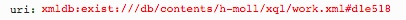

# getAnnotationMeta.xql
## Input parameters:
```
$uri := request:get-parameter('uri', '')
```
## Import:
```
../xqm/annotation.xqm

../xqm/source.xqm

../xqm/util.xqm
```
## Return HTML Fragment
Returns a HTML representation of an Annotation's content:
1. In annotation.xqm returns an annotation's priority.
2. In annotation.xqm returns an array of annotation's categories.
3. In util.xql retuns an array of document labels.
4. In source.xql returns an array of source sigla.

## Example
### Parameter

### HTML Result
```
<div class="annotView">
    <div class="metaBox">
        <div class="property priority">
            <div class="key">Priority</div>
            <div class="value"></div>
        </div>
        <div class="property categories">
            <div class="key">Category</div>
            <div class="value"></div>
        </div>
        <div class="property sourceLabel">
            <div class="key">Sources</div>
            <div class="value">Full Score, A Autograph Score, A´ Facsimile Edition 1924</div>
        </div>
        <div class="property sourceSiglums">
            <div class="key">Source</div>
            <div class="value"></div>
        </div>
    </div>
</div>
```


