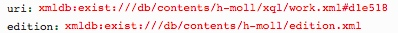

# getAnnotationPreviews.xql
 ## Input parameters:
```
$edition := request:get-parameter('edition', '')

$uri := request:get-parameter('uri', '')
```
## Import:
```
../xqm/annotation.xqm

../xqm/source.xqm

../xqm/teitext.xqm

../xqm/util.xqm

../xqm/edition.xqm
```
## Following informations are returned for text- or for source-participants
(TODO)
type
label
mdiv
page
source
siglum
digilibBaseParams
digilibSizeParams
hiddenData"
content
linkUri

## Example
### Parameter


### Fragment Result JSON
```
{"success": "true", "participants": [{"type":"measure","label":"","mdiv":"","page":"4","source":"Full Score","siglum":"","digilibBaseParams":"../../../digilib/images/Scaler/h-moll/edition/Neusatz_s004.jpg?","digilibSizeParams":"&amp;amp;wx=0.7889784946236559&amp;amp;wy=0.041688379364252216&amp;amp;ww=0.13172043010752688&amp;amp;wh=0.44346013548723295&amp;amp;mo=fit","hiddenData":"{width:392, height:1702, x:2348, y:160, origH:3838, origW:2976}","content":"","linkUri":"xmldb:exist:///db/contents/h-moll/neusatz.xml#measure-2-d4e27"},...]}
```


