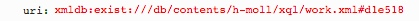

# getAnnotationText.xql
## Input parameters:
```
$uri := request:get-parameter('uri', '')
```
## Import:
```
../xqm/annotation.xqm
```
## Return HTML Fragment
Returns a HTML representation of an Annotation's content
1. getContent in annotation.xqm 
2. transform with meiP2html.xsl

## Example
### Parameter


### XML
```
...
<annot type="editorialComment" xml:id="d1e518" plist="xmldb:exist:///db/contents/h-moll/neusatz.xml#measure-2-d4e27 xmldb:exist:///db/contents/h-moll/autograph.xml#edirom_measure_24f1c82e-43b8 xmldb:exist:///db/contents/h-moll/inselautograph.xml#edirom_measure_24f1c82e-43b8_insel">
	<title>1. Kyrie I, m. 19, Fl I, II</title>
	<p>
	<rend rend="bold">A</rend>
	: with slur on 19/8–20/1
	</p>
	<ptr type="priority" target="#ediromAnnotPrio1"/>
	<ptr type="categories" target="#SLA"/>
</annot>
...
```
                        
### Result HTML
```
<div class="annotView">
    <div class="contentBox">
        <h1>1. Kyrie I, m. 19, Fl I, II</h1>
        <p xmlns:mei="http://www.music-encoding.org/ns/mei">
        	<span class="bold" style="font-weight: bold;">A</span>
       		: with slur on 19/8–20/1</p>
    </div>
</div>
```


