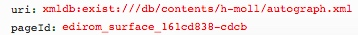
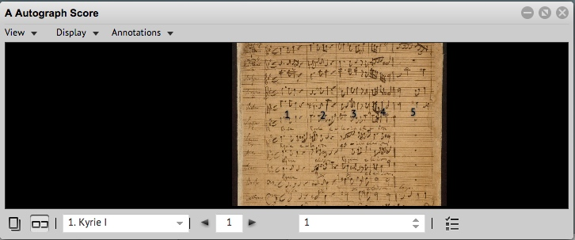

# getMeasuresOnPage.xql
## Input parameters:
```
$uri := request:get-parameter('uri', '')
 
$surfaceId := request:get-parameter('pageId', '')
```
## Show following data informations
for each measure

                        'rest: "', local:getMRest($measure), '"',

1. zoneId:
```
$zone/string(@xml:id)
```

2. ulx:
```
$zone/string(@ulx)
```

3. uly:
```
$zone/string(@uly)
```

4. lrx:
```
$zone/string(@lrx)
```

5. lry:
```
$zone/string(@lry)
```

6. id:
```
$measure/string(@xml:id)
```

7. name:
```
$measure/string(@n)
```

8. type:
```
$measure/string(@type)
```

9. rest:
```
if($measure//mei:mRest)
then(string('1'))
else 
	if($measure//mei:multiRest)
	then($measure//mei:multiRest/string(@num))
	else(string('0'))
```

## Example
### Parameter


### XML
```
<surface xml:id="edirom_surface_161cd838-cdcb" n="1">
                <graphic target="h-moll/source_P_180/P_180_003.jpg" xml:id="graphic_facsimile-P_180_003" type="facsimile" width="769" height="1200" label="003"/>
                <zone xml:id="edirom_zone_d557a0e0-ce2c" type="measure" ulx="111" uly="70" lrx="281" lry="654"/>
```
### Result
```
{zoneId: "edirom_zone_d557a0e0-ce2c", ulx: "111", uly: "70", lrx: "281", lry: "654", id: "edirom_measure_8ed5a31e-5f94", name: "1", type: "", rest: "0"}
...
```



