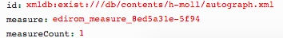

# getMeasurePage.xql
## Input parameters:
```
$id := request:get-parameter('id', '')

$measureIdName := request:get-parameter('measure', '')

$movementId := request:get-parameter('movementId', '')

$measureCount := request:get-parameter('measureCount', '1')
```
## Show following data informations
for measure with $measureIdName

1. measureId:
```
$measure/string(@xml:id)
```

2. zoneId:
```
substring-after($measure/string(@facs), '#')
```

3. pageId:
```
let $zoneId := substring-after($measure/string(@facs), '#')
let $zone := $mei/id($zoneId)
let $surface := $zone/parent::mei:surface
```
```
$surface/string(@xml:id)
```

4. path:
```
$surface/mei:graphic[@type='facsimile']/string(@target)
```

5. width:
```
$surface/mei:graphic[@type='facsimile']/string(@width)
```

6. height:
```
$surface/mei:graphic[@type='facsimile']/string(@height)
```

7. ulx:
```
$mei/id($zoneId)/string(@ulx)
```

8. uly:
```
$mei/id($zoneId)/string(@uly)
```

9. lrx:
```
$mei/id($zoneId)/string(@lrx)
```

10. lry:
```
$mei/id($zoneId)/string(@lry)
``` 
## Example
### Parameter


### XML
```
...
<surface xml:id="edirom_surface_161cd838-cdcb" n="1">
	<graphic target="h-moll/source_P_180/P_180_003.jpg" xml:id="graphic_facsimile-P_180_003" type="facsimile" width="769" height="1200" label="003"/>
	 <zone xml:id="edirom_zone_d557a0e0-ce2c" type="measure" ulx="111" uly="70" lrx="281" lry="654"/>
...
<section>
	<measure xml:id="edirom_measure_8ed5a31e-5f94" n="1" facs="#edirom_zone_d557a0e0-ce2c"/>
...
```
### JSON Result
```
{measureId:"edirom_measure_8ed5a31e-5f94",zoneId:"edirom_zone_d557a0e0-ce2c",pageId:"edirom_surface_161cd838-cdcb", movementId:"",path: "h-moll/source_P_180/P_180_003.jpg", width: "769", height: "1200", ulx: "111", uly: "70", lrx: "281", lry: "654"}
```

