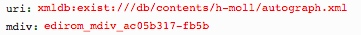

# getMeasures.xql
## Input parameters:
```
$uri := request:get-parameter('uri', '')

$mdivID := request:get-parameter('mdiv', '')
```
## Show following data informations
### If mei:parts exists:
```
$mdiv := $mei/id($mdivID)
```
for each 
```
$measureN in distinct-values($mdiv//mei:measure/@n):
```

1. name:
```
$measureN
```

2. mdivs:
```
$mdiv/@xml:id
```

3. ID:
```
"measure_', $mdiv/@xml:id, '_', $measureN, '"
```

4. measures:
```
let $measureNNumber := number($measureN)

let $measures := $mdiv//mei:measure[.//mei:multiRest][number(@n) lt $measureNNumber][.//mei:multiRest/number(@num) gt ($measureNNumber - number(@n))]
            
let $measures := for $measure in $mdiv//mei:measure[@n = $measureN] | $measures
		return
			concat('{id:"', $measure/@xml:id, '", voice: "', $measure/ancestor::mei:part//mei:staffDef/@decls, '"}')
```

### Else:
```
for $measure in $mei/id($mdivID)//mei:measure
```

1. name:
```
$measure/@n
```

2. mdivs:
```
$measure/ancestor::mei:mdiv[1]/@xml:id
```

3. ID:
```
$measure/@xml:id
```

4. measures:
```
[{id:"', $measure/@xml:id, '", voice: "score"}]
```

## Example
### Parameter


### XML
```
...
<mdiv xml:id="edirom_mdiv_ac05b317-fb5b" label="1. Kyrie I">
<staffDef decls="#score"/>
<measure xml:id="edirom_measure_8ed5a31e-5f94" n="1" facs="#edirom_zone_d557a0e0-ce2c"/>
...
```
### Result JSON
```
{id: "measure_edirom_mdiv_ac05b317-fb5b_1", measures: [{id:"edirom_measure_8ed5a31e-5f94", voice: "#score"}], mdivs: ["edirom_mdiv_ac05b317-fb5b"], name: "1"}
...
```


