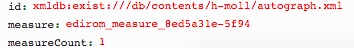

## Following services are called

## [getParts.xql](../getParts.md)

### Parameter


### XML
```
...
<part xml:id="score13" label="Score">
	<staffDef decls="#score"/>
...
<part xml:id="score12a" label="Duo Voces Articuli">
	<staffDef decls="#duoVoce"/>
...                 
```
### JSON Result
```
{label: "Score", id:"score", selectedByDefault:true, selected:true},
{label: "Duo Voces Articuli", id:"duoVoce", selectedByDefault:true, selected:true}
```

## [getMeasures.xql](../getMeasures.md)
## Example
### Parameter


### XML
```
...
<mdiv xml:id="edirom_mdiv_ac05b317-fb5b" label="1. Kyrie I">
<staffDef decls="#score"/>
<measure xml:id="edirom_measure_8ed5a31e-5f94" n="1" facs="#edirom_zone_d557a0e0-ce2c"/>
...
```
### Result JSON
```
{id: "measure_edirom_mdiv_ac05b317-fb5b_1", measures: [{id:"edirom_measure_8ed5a31e-5f94", voice: "#score"}], mdivs: ["edirom_mdiv_ac05b317-fb5b"], name: "1"}
...
```

## [getMeasurePage.xql](../getMeasurePage.md)

## Example
### Parameter


### XML
```
...
<surface xml:id="edirom_surface_161cd838-cdcb" n="1">
	<graphic target="h-moll/source_P_180/P_180_003.jpg" xml:id="graphic_facsimile-P_180_003" type="facsimile" width="769" height="1200" label="003"/>
	 <zone xml:id="edirom_zone_d557a0e0-ce2c" type="measure" ulx="111" uly="70" lrx="281" lry="654"/>
...
<section>
	<measure xml:id="edirom_measure_8ed5a31e-5f94" n="1" facs="#edirom_zone_d557a0e0-ce2c"/>
...
```
### JSON Result
```
{measureId:"edirom_measure_8ed5a31e-5f94",zoneId:"edirom_zone_d557a0e0-ce2c",pageId:"edirom_surface_161cd838-cdcb", movementId:"",path: "h-moll/source_P_180/P_180_003.jpg", width: "769", height: "1200", ulx: "111", uly: "70", lrx: "281", lry: "654"}
```

