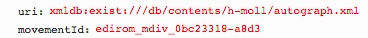
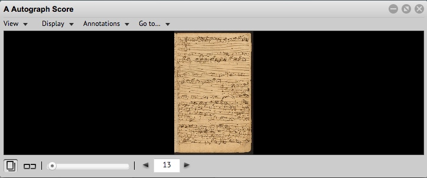

## Example
### Parameter


### XML
```
...
<surface xml:id="edirom_surface_2c3ed6b8-0158" n="60">
	<graphic target="h-moll/source_P_180/P_180_060.jpg" xml:id="graphic_facsimile-P_180_060" type="facsimile" width="788" height="1200" label="060"/>
		<zone xml:id="edirom_zone_46ff300f-c5f0a" type="measure" ulx="41" uly="63" lrx="143" lry="598"/>
		<zone xml:id="edirom_zone_46ff300f-c5f0" type="measure" ulx="101" uly="63" lrx="223" lry="598"/>
...
<mdiv xml:id="edirom_mdiv_0bc23318-a8d3" label="7b. Qui tollis">
	<parts>
		<part xml:id="score7b" label="Score">
			<staffDef decls="#score"/>
			<section>
				<measure xml:id="edirom_measure_ffe3b6b8-b564" n="96" facs="#edirom_zone_46ff300f-c5f0"/>
...
```
### Result
```
edirom_surface_0a04f778-f0a0
```



