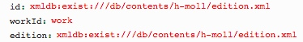

# getConcordances.xql
## Input parameters:
```
$id := request:get-parameter('id', '')

$workId := request:get-parameter('workId', '')
```
## Following informations are shown
#### For each
``` 
$concordance in $concordances
```

##### name:
```
$work//edirom:concordance/string(@name)
```

##### groups
```
'label: "', $parent/edirom:groups/string(@label)
```
for each group: $parent/edirom:groups
```
name: $group/string(@name)

connections:
	label: $parent/edirom:connections/string(@label)

connections:
	{ name: $connection/string(@name), 
	  plist: $connection/@plist
	}
```

connections
```
connections:
	label: $parent/edirom:connections/string(@label)

connections:
	{ name: $connection/string(@name), 
	  plist: $connection/@plist
	}
```
## Example
### Parameter


### XML
```
...
 <concordance xmlns:mei="http://www.music-encoding.org/ns/mei" xmlns:e13="http://www.edirom.de/ns/1.3" name="Concordance">
 	<groups label="Satz">
 		<group name="1. Kyrie I">
 			<connections label="Takt">
 				<connection name="1" plist="xmldb:exist:///db/contents/h-moll/hering.xml#edirom_measure_c2d127fe-afb0 xmldb:exist:///db/contents/h-moll/kirnberger.xml#edirom_measure_52c68392-c990 xmldb:exist:///db/contents/h-moll/neusatz.xml#measure-2-d4e4 xmldb:exist:///db/contents/h-moll/autograph.xml#measure_edirom_mdiv_ac05b317-fb5b_1 xmldb:exist:///db/contents/h-moll/inselautograph.xml#measure_edirom_mdiv_ac05b317-fb5b_insel_1 xmldb:exist:///db/contents/h-moll/source_D-21.xml#measure_edirom_mdiv_47c7bd29-4035-4371-bf5a-85dc9050429b_1"/>
...                             
```

### Result
```
{name: "Concordance", 
groups: {label: "Satz", 
groups: [
{name: "1. Kyrie I", 
connections: {label: "Takt", connections: [{name: "1", 
plist: "xmldb:exist:///db/contents/h-moll/hering.xml#edirom_measure_c2d127fe-afb0 xmldb:exist:///db/contents/h-moll/kirnberger.xml#edirom_measure_52c68392-c990 xmldb:exist:///db/contents/h-moll/neusatz.xml#measure-2-d4e4 xmldb:exist:///db/contents/h-moll/autograph.xml#measure_edirom_mdiv_ac05b317-fb5b_1 xmldb:exist:///db/contents/h-moll/inselautograph.xml#measure_edirom_mdiv_ac05b317-fb5b_insel_1 xmldb:exist:///db/contents/h-moll/source_D-21.xml#measure_edirom_mdiv_47c7bd29-4035-4371-bf5a-85dc9050429b_1"},...
                
```

