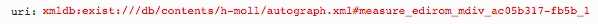

# getInternalIdType.xql
## Input parameters:
```
$uri := request:get-parameter('uri', '')
```
## Show following data informations
internalId:
```
if(contains($uri, '#'))
then(substring-after($uri, '#'))
else()

if(contains($internalId, '?'))
then(substring-before($internalId, '?'))
else($internalId)
```

for internal following steps:
```
$internal := $doc/id($internalId)


$internal := if(exists($internal))
then($internal)
else(
	if(starts-with($internalId, 'measure_') and $doc//mei:parts)
	then( let $mdivId := functx:substring-before-last(substring-after($internalId, 'measure_'), '_')
		let $measureN := functx:substring-after-last($internalId, '_')
		return ($doc/id($mdivId)//mei:measure[@n eq $measureN])[1])
	else($internal))
	
	
local-name($internal)
```

## Example
### Parameter


### XML
```
...
 <concordance xmlns:mei="http://www.music-encoding.org/ns/mei" xmlns:e13="http://www.edirom.de/ns/1.3" name="Concordance">
 	<groups label="Satz">
 		<group name="1. Kyrie I">
 			<connections label="Takt">
 				<connection name="1" plist="xmldb:exist:///db/contents/h-moll/hering.xml#edirom_measure_c2d127fe-afb0 xmldb:exist:///db/contents/h-moll/kirnberger.xml#edirom_measure_52c68392-c990 xmldb:exist:///db/contents/h-moll/neusatz.xml#measure-2-d4e4 xmldb:exist:///db/contents/h-moll/autograph.xml#measure_edirom_mdiv_ac05b317-fb5b_1 xmldb:exist:///db/contents/h-moll/inselautograph.xml#measure_edirom_mdiv_ac05b317-fb5b_insel_1 xmldb:exist:///db/contents/h-moll/source_D-21.xml#measure_edirom_mdiv_47c7bd29-4035-4371-bf5a-85dc9050429b_1"/>
...                             
```

### Result
```
measure
```

