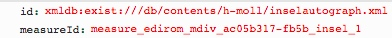

# getMeasure.xql
## Input parameters:
```
$id := request:get-parameter('id', '')

$measureId := request:get-parameter('measureId', '')
```
## Show following data informations
measureId:
```
if(contains($measureId, '?'))
then(substring-before($measureId, '?'))
else($measureId)
```

movementId :
```
$mei := doc($id)/root()

$movementId := $mei/id($measureId)/ancestor::mei:mdiv[1]/@xml:id

$movementId := if(starts-with($measureId, 'measure_') and $mei//mei:parts)
then(functx:substring-before-last(substring-after($measureId, 'measure_'), '_'))
else($movementId)
```

measureCount:
```
if(contains($measureId, 'tstamp2='))
then(number(substring-before(substring-after($measureId, 'tstamp2='), 'm')) + 1)
else(1)
```
## Example
### Parameter


### XML
```
...
 <concordance xmlns:mei="http://www.music-encoding.org/ns/mei" xmlns:e13="http://www.edirom.de/ns/1.3" name="Concordance">
 	<groups label="Satz">
 		<group name="1. Kyrie I">
 			<connections label="Takt">
 				<connection name="1" plist="xmldb:exist:///db/contents/h-moll/hering.xml#edirom_measure_c2d127fe-afb0 xmldb:exist:///db/contents/h-moll/kirnberger.xml#edirom_measure_52c68392-c990 xmldb:exist:///db/contents/h-moll/neusatz.xml#measure-2-d4e4 xmldb:exist:///db/contents/h-moll/autograph.xml#measure_edirom_mdiv_ac05b317-fb5b_1 xmldb:exist:///db/contents/h-moll/inselautograph.xml#measure_edirom_mdiv_ac05b317-fb5b_insel_1 xmldb:exist:///db/contents/h-moll/source_D-21.xml#measure_edirom_mdiv_47c7bd29-4035-4371-bf5a-85dc9050429b_1"/>
...                             
```
### Result
```
{measureId:"measure_edirom_mdiv_ac05b317-fb5b_insel_1",movementId:"edirom_mdiv_ac05b317-fb5b_insel",measureCount:"1"}
```

