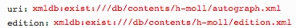

# getParts.xql
## Input parameters:
```
$uri := request:get-parameter('uri', '')
```
## Show following data informations
For each part in mei:instrumentation/mei:instrVoice

1. Label:
```
$part/@label
```

2. ID:
```
$part/@xml:id
```

3. selectedByDefault: true

4. selected: true

## Example
### Parameter


### XML
```
...
<part xml:id="score13" label="Score">
	<staffDef decls="#score"/>
...
<part xml:id="score12a" label="Duo Voces Articuli">
	<staffDef decls="#duoVoce"/>
...                 
```
### JSON Result
```
{label: "Score", id:"score", selectedByDefault:true, selected:true},
{label: "Duo Voces Articuli", id:"duoVoce", selectedByDefault:true, selected:true}
```


